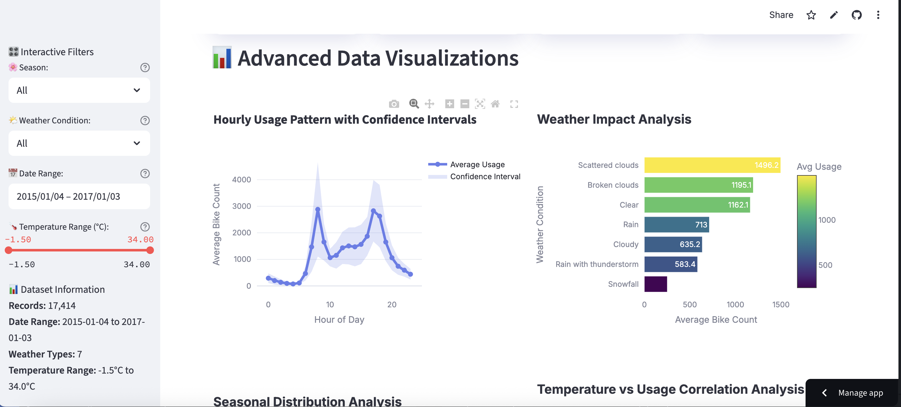

# 🚴‍♀️ Bike Ride Data Analytics Project

## 📊 Project Overview

This project explores bike-sharing data to uncover usage patterns, seasonal trends, and rider behavior across time. By leveraging real-world datasets, we perform exploratory data analysis (EDA), time-series modeling, and interactive data visualizations to understand how people use shared bikes in urban environments.

---

## 🧰 Tools & Technologies

- **Python** – for data preprocessing and analysis  
- **Pandas / NumPy** – for data wrangling  
- **Plotly / Streamlit** – for interactive web-based visualizations  
- **Tableau** – for dashboard development (optional)  
- **Kaggle** – data source  
- **Git & GitHub** – version control and collaboration  

---

## 📁 Dataset

- **Source**: [Kaggle – Bike Sharing Dataset](https://www.kaggle.com/)
- **Key fields**:
  - Ride start & end time  
  - User type (Subscriber / Customer)  
  - Station names  
  - Ride duration  
  - Bike types  
  - Weather data (if included)

> ⚠️ **Note**: The raw dataset and Kaggle API key are excluded from this repository for security reasons.

---

## 📈 Key Features

- 📊 Interactive visualizations with Streamlit  
- 🧭 Moving averages by day, week, month  
- 🌤️ Weather and seasonal influence on ridership  
- 📅 Weekday vs. weekend usage patterns  
- 📍 Top starting and ending stations  
- ⏱️ Peak hour analysis  
- 👤 User-type comparison (if available)

---

## 📷 Preview

 <!-- Replace with actual image path or remove if unavailable -->

---

## 🚀 How to Use

1. **Clone the repository**  
   ```bash
   git clone https://github.com/gulIbrahimi/Bike-Ride-Data-Analytics-Project.git
   cd Bike-Ride-Data-Analytics-Project
# 🚴‍♀️ Bike Ride Data Analytics Project

## 📊 Project Overview

This project explores bike-sharing data to uncover usage patterns, seasonal trends, and rider behavior across time. By leveraging real-world datasets, we perform exploratory data analysis (EDA), time-series modeling, and interactive data visualizations to understand how people use shared bikes in urban environments.

---

## 🧰 Tools & Technologies

- **Python** – for data preprocessing and analysis  
- **Pandas / NumPy** – for data wrangling  
- **Plotly / Streamlit** – for interactive web-based visualizations  
- **Tableau** – for dashboard development (optional)  
- **Kaggle** – data source  
- **Git & GitHub** – version control and collaboration  

---

## 📁 Dataset

- **Source**: [Kaggle – Bike Sharing Dataset](https://www.kaggle.com/)
- **Key fields**:
  - Ride start & end time  
  - User type (Subscriber / Customer)  
  - Station names  
  - Ride duration  
  - Bike types  
  - Weather data (if included)

> ⚠️ **Note**: The raw dataset and Kaggle API key are excluded from this repository for security reasons.

---

## 📈 Key Features

- 📊 Interactive visualizations with Streamlit  
- 🧭 Moving averages by day, week, month  
- 🌤️ Weather and seasonal influence on ridership  
- 📅 Weekday vs. weekend usage patterns  
- 📍 Top starting and ending stations  
- ⏱️ Peak hour analysis  
- 👤 User-type comparison (if available)

---

## How to Use

1. **Clone the repository**  
  git clone https://github.com/gulIbrahimi/Bike-Ride-Data-Analytics-Project.git
  cd Bike-Ride-Data-Analytics-Project
2. **Install dependencies**  
  pip install -r requirements.txt
3. **Add your dataset**
  Place your CSV file in the /data/ folder (e.g. data/bike_data.csv).
4. **Run the streamlit app**
  streamlit run app.py

## Contact
**For questions, suggestions, or collaboration ideas:**
Gul Amiz Ibrahimi – LinkedIn • https://gulibrahimi.com/